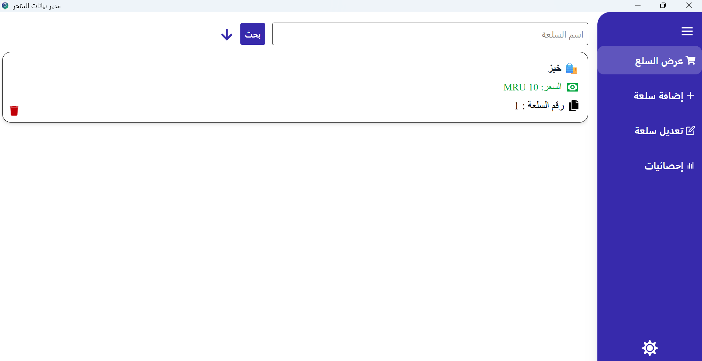
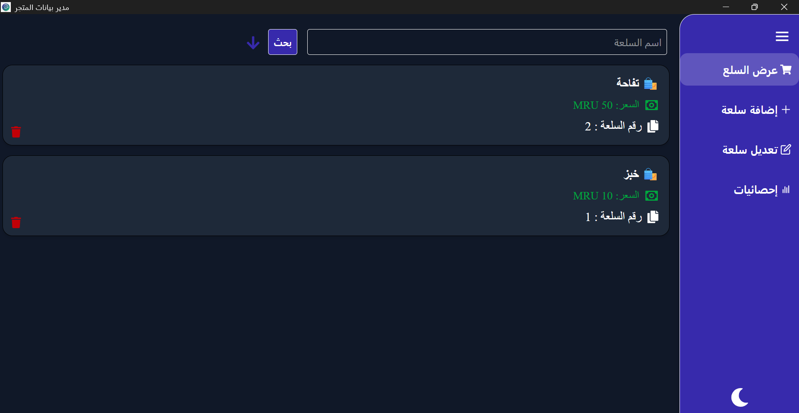
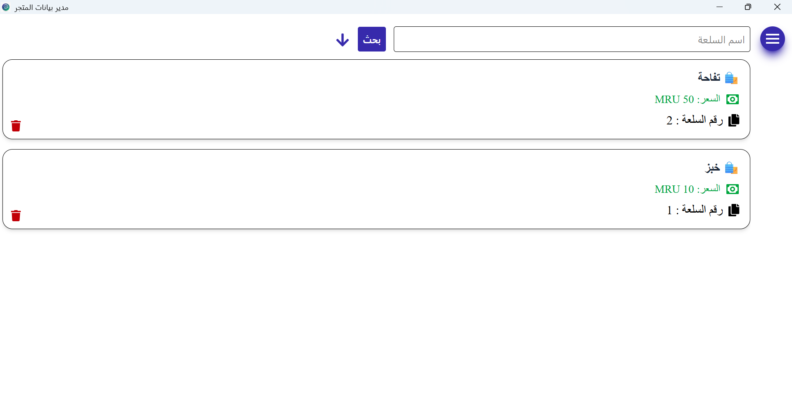
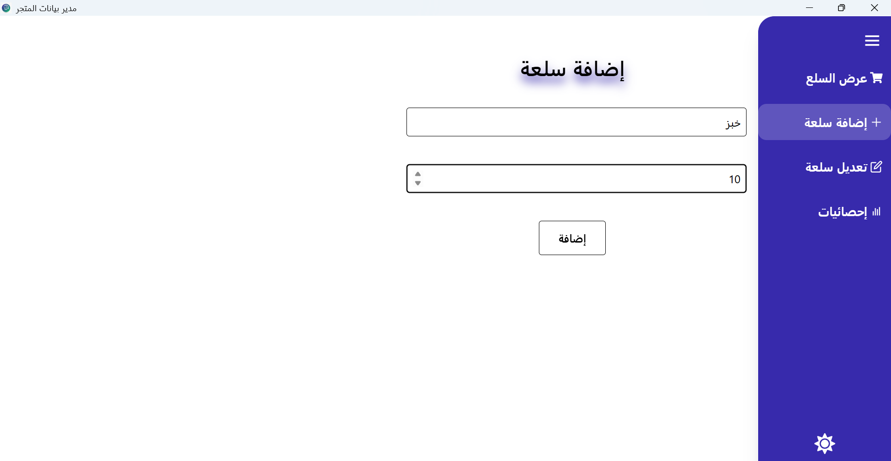
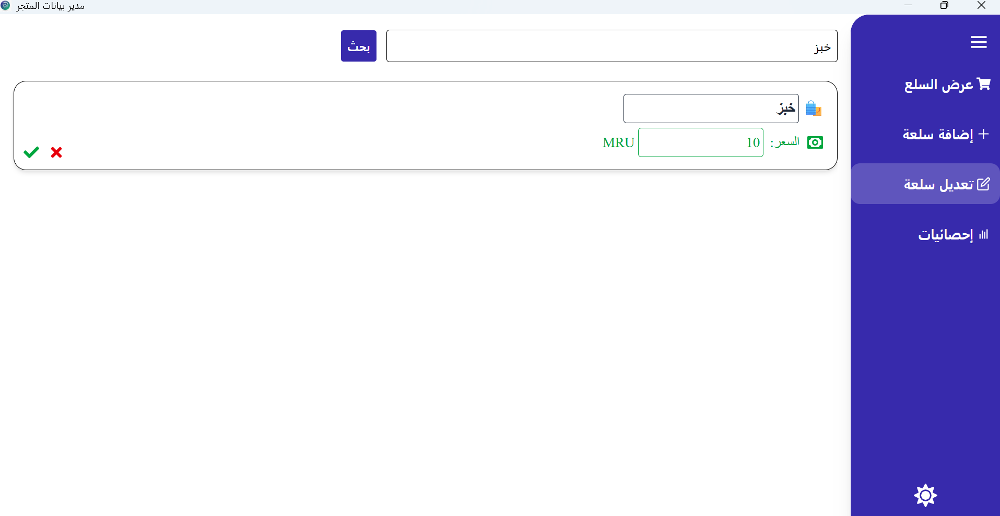
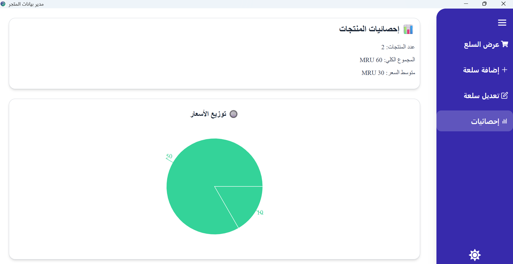

# Gestion des produits

**Une belle application de gestion des produits d'un magasin d'interface en Arabe**













## Thechnologies principales de l'application

- Tauri
- React
- typescript

## ✨ Fonctionnalités

* **CRUD** (Création, Lecture, Mise à jour, Suppression) de produits.
* **Recherche et Triage**.

## Utilisation
```bash
npm install
npm run tauri dev